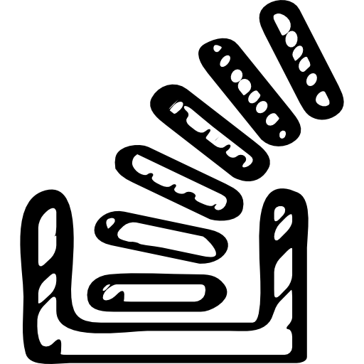

<h1>Hi, I'm <a href="www.chinagaines.com">China</a></h1> 

<h3 align=center>China Gaines | Front-end Developer | Charlotte, NC, U.S.A</h3>

 

    <!-- Linked-in Icon-- accedited to Freepik on flaticon.com-->
    &nbsp;&nbsp;
    <!--Stack Overflow Icon-- accredited to Freepik onn flaticon.com-->
    &nbsp;&nbsp;
 

<!-- Languages and Tools > -->
## Languages and Tools 

  <!-- Icons accedited to https://github.com/MikeCodesDotNET/ColoredBadges . Please follow Mike! -->
      
  
 

HTML5

CSS3

Javascript

Git / Github

Sass

Tools: Undraw (for open-source svg graphics), flaticon (for open-source icons), google fonts (for fonts), gsap (for animating w/ javascript), 

## How Did I Learn?

MDN Documentation
Stack Overflow
Youtube

<!-- 
HTML
CSS/SASS
Javascript
-->

<!--[] -->

<!--
**mschinagaines/mschinagaines** is a ✨ _special_ ✨ repository because its `README.md` (this file) appears on your GitHub profile.

Here are some ideas to get you started:

- 🔭 I’m currently working on ...
- 🌱 I’m currently learning ...
- 👯 I’m looking to collaborate on ...
- 🤔 I’m looking for help with ...
- 💬 Ask me about ...
- 📫 How to reach me: ...
- 😄 Pronouns: ...
- ⚡ Fun fact: ...
-->
